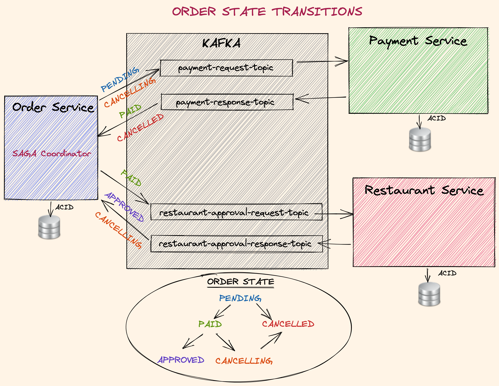

# 주문 프로젝트

## 프로젝트 overview

## 주문 서비스

## 주문 도메인 로직 

## 주문상태

# 문서 자동화 
* 설계 툴 설치
[windows_10_cmake_Release_graphviz-install-14.0.1-win64.exe](windows_10_cmake_Release_graphviz-install-14.0.1-win64.exe)

* 사용법
  - Visualize dependencies:
  - https://github.com/ferstl/depgraph-maven-plugin
  - mvn com.github.ferstl:depgraph-maven-plugin:aggregate -DcreateImage=true -DreduceEdges=false -Dscope=compile "-Dincludes=com.autumnia.shopsystem*:*"

